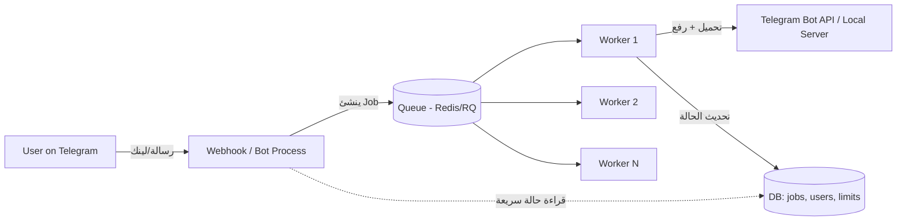

# بناء بوت تحميل فيديوهات كبير على تيليجرام — دليل هندسي كامل

هذا الملف بيشرح إزاي كنت هصمم وأبني التطبيق ده من الصفر لو كان مشروع **إنتاجي كبير** (مش مجرد بوت تعليمي)، وإيه القواعد والاختبارات اللي بلتزم بيها عشان يشتغل بثبات مع آلاف المستخدمين. الهدف إنك تتعلم طريقة التفكير الهندسي، مش بس "الكود الصح".

---

## 1. الفكرة الأساسية: افصل "الاستقبال" عن "الشغل التقيل"

أكبر غلطة بيقع فيها أي حد بيبني بوت زي ده هي إنه يخلي البوت نفسه (اللي بيستقبل رسائل تيليجرام) هو نفسه اللي بيحمّل الفيديو ويرفعه. ده بيبوظ في أول لحظة يبعتلك فيها 5 مستخدمين لينكات في نفس الوقت.

**التصميم الصح:**



- **Bot process**: بيستقبل الرسالة بس، يتحقق من اللينك بسرعة (شكله صحيح؟ مستخدم عنده صلاحية؟)، يحط "Job" في طابور (queue)، ويرد فورًا "استلمت طلبك".
- **Workers**: عمليات منفصلة (ممكن تكون على نفس السيرفر أو سيرفرات تانية) بتسحب من الطابور وتنفذ التحميل/الرفع الفعلي، وتحدّث حالة الطلب في قاعدة بيانات.
- ده معناه لو عامل تحميل واحد وقع أو استهلك وقت طويل، البوت نفسه لسه شغال وبيرد على مستخدمين تانيين.

في نسخة صغيرة (زي اللي بنيناها) ممكن نستخدم `asyncio.Semaphore` جوه نفس البروسيس بدل Redis Queue كامل — ده مقبول لعدد مستخدمين محدود، لكن في تطبيق كبير (آلاف المستخدمين، أكتر من سيرفر Render) لازم Queue حقيقي (Celery / arq / RQ + Redis) لأن الـ Semaphore في الذاكرة مش هيتشارك بين instances مختلفة.

---

## 2. مكونات النظام (Components)

| المكون | المسؤولية |
|---|---|
| **Ingestion** | استقبال الرسالة، فحص شكل اللينك، فحص حدود المستخدم (Rate limit) |
| **Extractor Layer** | طبقة فوق `yt-dlp` تحدد نوع المحتوى (فيديو مفرد / بلايليست / بث مباشر) وتستخرج المعلومات |
| **Download Manager** | يدير التزامن (كام تحميل شغال في نفس الوقت لكل مستخدم/عالميًا)، الطابور، الإلغاء |
| **Post-Processing** | دمج فيديو+صوت، تحويل الصيغة، **تقسيم الملفات الكبيرة** |
| **Upload Manager** | يرفع الملف على تيليجرام (مباشر أو عبر Local Bot API Server)، يدير إعادة المحاولة عند الفشل |
| **Storage/Cleanup** | ملفات مؤقتة، حذف تلقائي، حماية من امتلاء الديسك |
| **Notifier** | تحديث رسالة الحالة للمستخدم (progress bar) مع احترام حدود تيليجرام لعدد التعديلات |
| **Persistence** | قاعدة بيانات لتتبع الطلبات، المستخدمين، الحظر، الإحصائيات |

كل مكون لازم يكون **قابل للاستبدال منفرد** — مثلاً لو غيرت من `yt-dlp` لمكتبة تانية، ميفروضش تلمس كود الـ Telegram handlers خالص. ده اللي بيحصل لو عملت abstraction صح (زي `YTDLPDownloader` عندنا، بس هيبقى محتاج interface أوضح لو التطبيق كبر).

---

## 3. أهم نقطة سألتني عنها: رفع الملفات الكبيرة وتقسيم اللي أكبر من 2GB

### 3.1 الحقيقة اللي لازم تعرفها عن حدود تيليجرام

| الطريقة | أقصى حجم رفع |
|---|---|
| Cloud Bot API العادي (`api.telegram.org`) | **50 ميجا** |
| Local Bot API Server (تشغيله بنفسك) | **2000 ميجا (2GB) تقريبًا** — ده أقصى حد ممكن لأي بوت عادي، مفيش طريقة تتخطاه |
| حساب Telegram Premium أو حسابات مستخدمين عاديين (مش بوتات) | لغاية 4GB، لكن ده **مش متاح للبوتات** |

يعني حتى لو شغّلت Local Bot API Server، **2GB هو السقف المطلق**. أي ملف أكبر من كده **لازم يتقسم**، مفيش أي طريقة تانية.

### 3.2 إزاي تقسم فيديو "صح" (مش مجرد قص بايتات)

في طريقتين، وفرق كبير بينهم:

**❌ الطريقة الغلط: تقسيم بايتات خام (byte-split)**
تاخد الملف وتقسمه لأجزاء بالحجم بس (زي `split -b 1900M file.mp4`). النتيجة: كل جزء **مش ملف فيديو صالح للتشغيل** — المستخدم مضطر يجمعهم يدويًا بأمر `cat` أو أداة، وده تجربة استخدام سيئة جدًا لبوت تيليجرام عادي.

**✅ الطريقة الصح: تقسيم زمني بـ ffmpeg (segment-based)**
تقسم الفيديو لمقاطع زمنية، كل مقطع **ملف فيديو كامل شغال لوحده**:

```python
import subprocess
import math

def get_duration_and_size(path: str) -> tuple[float, int]:
    """يرجع (المدة بالثواني، الحجم بالبايت) عبر ffprobe."""
    out = subprocess.run(
        ["ffprobe", "-v", "error", "-show_entries", "format=duration",
         "-of", "default=noprint_wrappers=1:nokey=1", path],
        capture_output=True, text=True, check=True,
    )
    duration = float(out.stdout.strip())
    size = os.path.getsize(path)
    return duration, size


def split_video(path: str, target_part_bytes: int, out_dir: str) -> list[str]:
    """يقسم الفيديو لأجزاء كل واحد تحت target_part_bytes، بدون إعادة ترميز (سريع)."""
    duration, size = get_duration_and_size(path)
    if size <= target_part_bytes:
        return [path]

    num_parts = math.ceil(size / target_part_bytes)
    part_duration = duration / num_parts

    parts = []
    for i in range(num_parts):
        start = i * part_duration
        out_path = f"{out_dir}/part_{i+1}.mp4"
        subprocess.run([
            "ffmpeg", "-y", "-ss", str(start), "-i", path,
            "-t", str(part_duration),
            "-c", "copy",              # نسخ الستريم بدون إعادة ترميز = سريع جدًا
            "-avoid_negative_ts", "make_zero",
            out_path,
        ], check=True, capture_output=True)
        parts.append(out_path)
    return parts
```

**نقاط مهمة في التقسيم:**

1. **`-c copy` (stream copy)**: بينسخ الفيديو من غير إعادة ترميز، يعني سريع جدًا (ثواني بدل دقائق) ومفيش فقدان جودة. العيب الوحيد: القطع بيحصل عند أقرب **keyframe**، يعني ممكن الجزء يبدأ بثانية أو اتنين قبل/بعد النقطة المطلوبة بالظبط. لو محتاج قطع دقيق 100% لازم تعمل `-c:v libx264` (إعادة ترميز) وده أبطأ بكتير ومكلف على السيرفر.
2. **احسب حجم الهدف بهامش أمان**: متستخدمش 2GB بالظبط، استخدم حد أقل زي **1.9GB** عشان الـ overhead بتاع الـ container/metadata.
3. **رقم الأجزاء بيتحدد من الحجم مش المدة**: فيديو بجودة عالية (بيتريت كبير) هياخد وقت أقصر للجزء عشان يوصل نفس الحجم.
4. **سمّي الأجزاء بوضوح**: "الاسم - جزء 1 من 3" في الـ caption، عشان المستخدم يعرف يرتبهم.
5. **امسح كل الأجزاء بعد الرفع** (زي أي ملف مؤقت تاني).
6. **الصوت المنفصل (audio-only) أسهل**: لو المستخدم اختار "Audio Only"، نادرًا ما يعدي 2GB أصلاً، لكن لو حصل نفس المبدأ (تقسيم بـ ffmpeg بدل بايتات خام).

### 3.3 التدفق الكامل في الكود (Pseudocode)

```python
async def upload_with_splitting(file_path, update, context, caption, ...):
    file_size = file_path.stat().st_size

    if file_size <= Config.SAFE_UPLOAD_LIMIT:  # مثلاً 1.9GB
        await send_single_file(file_path, ...)
        return

    await status_msg.edit_text("📦 الملف كبير، جاري تقسيمه...")
    parts = await run_in_executor(split_video, file_path, Config.SAFE_UPLOAD_LIMIT, temp_dir)

    for i, part in enumerate(parts, start=1):
        await status_msg.edit_text(f"📤 رفع جزء {i}/{len(parts)}...")
        await send_single_file(part, caption=f"{caption}\n(جزء {i}/{len(parts)})")
        os.remove(part)  # امسح كل جزء فور رفعه، متسيبهوش لآخر الحلقة
```

**ملحوظة مهمة**: امسح كل جزء فور ما يترفع (مش تسيبهم لآخر الحلقة) — عشان لو حصل خطأ نص الطريق، متسيبش نسخ متعددة من فيديو 2GB على الديسك في نفس الوقت.

---

## 4. حاجات لازم تاخد بالك منها (Gotchas) — من واقع اللي حصل معانا فعلاً في المحادثة دي

كل نقطة هنا هي درس اتعلمناه من باج حقيقي حصل في البناء:

1. **رسالة الخطأ متبقاش فاضية أبدًا** — بعض الـ exceptions بترجع `str(e)` فاضي. لازم fallback لاسم نوع الخطأ + `logger.exception()` عشان تسجل الـ traceback الكامل، مش بس رسالة الخطأ.
2. **الـ imports/exports بين packages لازم يتفحصوا فعليًا (مش بس syntax check)** — باج `truncate_text` اللي حصل كان بيعدي على فحص الـ syntax لكن يفشل وقت التشغيل الفعلي. لازم اختبار "استورد التطبيق كامل" (`import main`) كجزء من أي فحص قبل النشر.
3. **أرقام عشرية (float) من مصادر خارجية زي yt-dlp** — مدة الفيديو ممكن ترجع `123.45` مش `123`. أي كود بيستخدم `:d` format code لازم يحوّل لـ `int` الأول.
4. **حدود خدمات خارجية (Telegram, YouTube, Cloudflare) بتتغير من غير سابق إنذار** — لازم كود مرن (feature flags عبر env vars) بدل افتراضات ثابتة، ومتابعة مستمرة لتحديثات `yt-dlp` (بيتحدث كل كام يوم بسبب تغييرات المواقع).
5. **الـ IP بتاع سيرفرات الاستضافة (Render, AWS, إلخ) بيتحظر أو يتشك فيه** من مواقع زي يوتيوب و Cloudflare أكتر من IP شخصي عادي — أي تصميم لازم يفترض إن ده هيحصل، ومحتاج خطط بديلة (بصمة متصفح مقلّدة impersonation، كوكيز، أو proxy).
6. **حدود Telegram على تعديل الرسائل (rate limit)** — لو عدّلت رسالة الحالة كل نص ثانية هتاخد "Too Many Requests". لازم throttling (عندنا كل 3 ثواني كحد أدنى).
7. **حماية الديسك من الامتلاء** — أي بوت بيحمل فيديوهات لازم يتحقق من المساحة الفاضية *قبل* بدء التحميل، مش بعد ما يفشل في النص. ولازم Job/queue تمنع تراكم عدد كبير من التحميلات المتزامنة اللي هتفضي الديسك.
8. **الـ webhook endpoint لازم يتحقق من مصدر الطلب** — تيليجرام بتدعم `secret_token` في الـ webhook، ولازم تتأكد إن الطلب الوارد فعلاً من تيليجرام مش من أي حد عارف الرابط (`/webhook`). التطبيق الحالي مبيعملش الفحص ده — دي نقطة أمان لازم تتصلح لو التطبيق هيبقى عام/كبير.
9. **أسماء الملفات من عنوان الفيديو** — عناوين فيديوهات ممكن فيها رموز غريبة أو أحرف مش مسموحة في أسماء الملفات (`/`, `:`, إيموجي كتير) أو تطول جدًا. لازم "sanitize" لاسم الملف قبل ما يتحفظ على الديسك.
10. **البلايليست ممكن يحتوي فيديوهات محذوفة/خاصة** — لازم كل فيديو في اللوب يتعامل معاه بشكل مستقل (فشل واحد مايوقفش الباقي)، وده عملناه فعلاً.
11. **إعادة تشغيل السيرفر (deploy جديد) وسط تحميل شغال** — Render بيوقف الـ container القديم فجأة عند كل نشر جديد. أي تحميل شغال وقتها هيضيع من غير ما المستخدم يعرف السبب. في تطبيق كبير: استخدم queue فيه persistence (Redis/DB) عشان لو الـ worker وقع، الـ job يترجع لحد آخر تاني يشتغل عليه.

---

## 5. القواعد اللي أمشي عليها (Engineering Rules)

### كتابة الكود
- **Type hints في كل مكان** + `mypy` أو `pyright` في الـ CI — يمسك أخطاء زي تمرير `None` لمكان محتاج `str`.
- **Linting + formatting آلي** (`ruff` + `black`) — قبل أي commit، عشان أخطاء زي الـ string literals المكسورة اللي حصلت معانا كانت هتتمسك فورًا.
- **مفيش استدعاءات "blocking" جوه الـ event loop** — أي حاجة بطيئة (yt-dlp, ffmpeg) لازم تتنفذ في `run_in_executor` أو `asyncio.to_thread`، زي ما عملنا بالظبط.
- **الإعدادات عبر مكتبة تحقق (زي Pydantic Settings)** بدل `os.getenv` يدوي — بيدّيك رسائل خطأ واضحة لو حد نسي متغير بيئة، بدل ما البرنامج يفشل بشكل غريب بعد كده بساعة.
- **كل استدعاء لخدمة خارجية له timeout صريح** — من غير timeout، أي تعليق في yt-dlp أو Telegram API هيجمّد الـ worker للأبد.
- **الملفات المؤقتة تتنضف في `finally`** — مش بعد النجاح بس، عشان تتنضف حتى لو حصل استثناء.

### البنية
- **افصل "التطبيق" (business logic) عن "التوصيل" (Telegram handlers)** — الـ `DownloadManager` ميعرفش حاجة عن تيليجرام، والـ handlers ميعرفوش تفاصيل yt-dlp الداخلية. ده بيسهّل تغيير أي طرف من غير ما يبوظ التاني.
- **لا تستخدم Singleton عالمي في الذاكرة لحالة مشتركة بين مستخدمين** إلا في نسخة صغيرة single-instance. في تطبيق كبير: استخدم Redis لعدادات التزامن والـ rate limiting، مش `dict` في الذاكرة.
- **Feature flags بدل افتراضات صلبة** — أي ميزة بتعتمد على شرط خارجي (Local Bot API متاح؟ كوكيز موجودة؟) لازم تتفعّل شرطيًا وتفشل بأمان (graceful fallback) لو مش متاحة، زي ما عملنا مع `TELEGRAM_API_ID`/`YTDLP_COOKIES_FILE`.

### العمليات (Operations)
- **Structured logging** (JSON logs) + أداة مراقبة أخطاء (Sentry أو مشابه) في تطبيق حقيقي — عشان تعرف بالأخطاء قبل ما المستخدمين يشتكوا.
- **Health checks حقيقية** — مش بس "السيرفر شغال"، لازم تتأكد إن الـ bot token صحيح، وإن فيه مساحة ديسك كافية.
- **Graceful shutdown** — لما Render يبعت `SIGTERM` قبل إعادة النشر، خلي الكود يخلص أي رفع شغال (أو على الأقل يعلّم الـ job إنه "معلّق" عشان يترجع) بدل ما يتقطع فجأة.
- **مراقبة تحديثات yt-dlp** — جدول (cron) أسبوعي يتأكد إن فيه نسخة أحدث، لأن مواقع زي يوتيوب بتغيّر حمايتها باستمرار.

---

## 6. استراتيجية الاختبارات (Testing)

### مستوى 1: اختبارات وحدة (Unit Tests) — سريعة، بدون شبكة
```python
def test_format_duration_handles_float():
    assert format_duration(125.9) == "2:05"

def test_format_duration_handles_none():
    assert format_duration(None) == "0:00"

def test_url_validator_accepts_any_wellformed_url():
    ok, _ = URLValidator.validate("https://example.com/video/1")
    assert ok is True

def test_url_validator_rejects_empty():
    ok, msg = URLValidator.validate("")
    assert ok is False
```
كل باج حصل معانا في المحادثة دي كان ممكن يتمسك بواحد من الاختبارات دي لو كانت موجودة من الأول (خصوصًا اختبار الـ float و اختبار الـ import الكامل).

### مستوى 2: اختبارات تكامل (Integration) — بمحاكاة (mock) الخدمات الخارجية
- محاكاة `yt_dlp.YoutubeDL.extract_info` (زي ما عملنا وإحنا بنصلح باج البلايليست) عشان تختبر منطق `DownloadManager`/`callbacks.py` من غير ما تكلم يوتيوب فعليًا.
- محاكاة `telegram.Bot` (فيه مكتبة `python-telegram-bot` بتوفر test utilities، أو تستخدم `unittest.mock.AsyncMock`) عشان تختبر إن الرسايل بتتبعت صح من غير ما تبعت فعليًا على تيليجرام.

### مستوى 3: اختبار "التطبيق كامل بيشتغل" (Smoke Test)
```bash
TELEGRAM_BOT_TOKEN=dummy python -c "import main"  # لازم ينجح من غير أي ImportError
```
ده كان كافي يمسك باج `truncate_text` فورًا. **لازم يبقى جزء أساسي من أي CI pipeline.**

### مستوى 4: اختبارات حالات حرجة (Edge cases) خاصة بالتطبيق ده
- فيديو مدته صفر / بلا مدة (`duration=None`)
- بلايليست فيها فيديو محذوف في النص
- ملف تحميل بحجم صفر (فشل صامت من yt-dlp)
- عنوان فيديو طوله 500 حرف / فيه إيموجي وأحرف خاصة
- ملف بالظبط عند حدود الحجم (1.99GB، 2.0GB، 2.01GB) — تأكد إن التقسيم بيشتغل عند الحد الصح
- انقطاع الشبكة نص التحميل (timeout)
- مستخدمين متزامنين بيحاولوا يحمّلوا في نفس الوقت (اختبار الـ semaphore)
- محاولة تحميل من موقع بيه حماية Cloudflare / يوتيوب بيطلب تسجيل دخول

### مستوى 5: اختبار حمل (Load Testing)
قبل ما تفتح البوت لعدد كبير من الناس، جرب:
- N مستخدم وهمي بيبعتوا لينكات في نفس اللحظة — راقب استهلاك الـ CPU/RAM/Disk.
- تأكد إن حد التزامن (`MAX_CONCURRENT_DOWNLOADS_PER_USER`) والحد العالمي بيتم احترامهم فعليًا تحت ضغط.

### أدوات مقترحة
- `pytest` + `pytest-asyncio` للاختبارات.
- `pytest-mock` أو `unittest.mock` للمحاكاة.
- `ruff` للـ linting, `mypy` للـ type checking.
- GitHub Actions (أو أي CI) يشغّل: lint → type-check → unit tests → smoke import test، على كل push، قبل ما تسمح بالـ merge.

---

## 7. اعتبارات لازم تاخدها في الحسبان (مش تقنية بحتة لكن مهمة لمشروع كبير)

- **حقوق الملكية الفكرية**: بوت "حمّل أي فيديو من أي مكان" وأنت بتشغّله لعدد كبير من الناس بيحمّل غالبًا محتوى محمي بحقوق نشر. في تطبيق حقيقي كبير لازم: شروط استخدام واضحة، تقييد الاستخدام الشخصي، آلية للرد على شكاوى إزالة المحتوى (DMCA-style)، وربما تقييد استخدام البوت لمحتوى الشخص نفسه بس. ده قرار عمل (business decision) مش تقني، لكن مهم جدًا قبل ما تفتح البوت للعامة.
- **إساءة الاستخدام (Abuse)**: حد أقصى لعدد الطلبات يوميًا لكل مستخدم، قائمة حظر، وربما CAPTCHA أو تحقق للمستخدمين الجدد لو البوت بقى معروف واتهاجم بالسبام.
- **التكلفة**: تحميل ورفع فيديوهات 2GB بشكل متكرر مكلف على الباندويدث والتخزين — راقب فاتورة Render (أو أي مزود) لأنها ممكن تكبر بسرعة مع الاستخدام الكبير.

---

## خلاصة: لو هبدأ من الصفر، هرتّب الأولويات كده

1. **MVP**: بوت بسيط بـ semaphore في الذاكرة (زي اللي عندنا دلوقتي) + Local Bot API Server للرفع الكبير + تقسيم بـ ffmpeg.
2. **v2 (لو الاستخدام كبر)**: انقل الحالة المشتركة لـ Redis، أضف queue حقيقي (Celery/arq)، أضف قاعدة بيانات لتتبع الطلبات والمستخدمين.
3. **v3 (إنتاج كامل)**: مراقبة وتنبيهات (Sentry/Grafana)، rate limiting عالمي محكم، آلية شكاوى محتوى، فصل الـ workers عن الـ web process على سيرفرات منفصلة تتوسع باستقلالية.

كل خطوة في القائمة دي بتحل مشكلة حقيقية هتظهر لما عدد المستخدمين يزيد — مفيش داعي تبنيها كلها من الأول، لكن مهم تعرف إنها موجودة عشان تصمم الكود بشكل يسمح بالانتقال ليها بسهولة بدل ما تعيد كتابة كل حاجة من الصفر.
